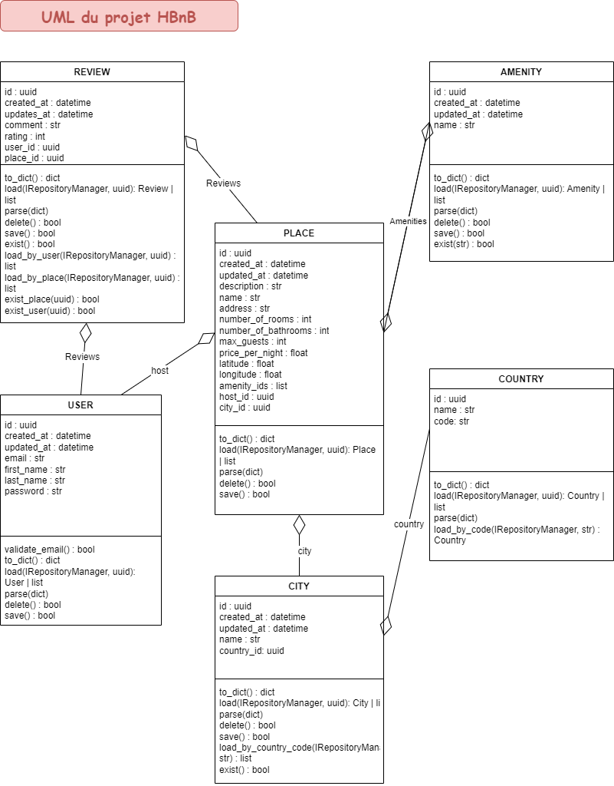

# holbertonschool-hbnb

## Description
Bienvenue dans la première étape de notre passionnant voyage - la création de notre propre application web, **HBnB Evolution**, modélisée d'après AirBnB en utilisant *Python* et *Flask*!

### Ce projet inclut :
- Une console pour gérer les objets de l'application
- Une API RESTful
- Une interface web pour interagir avec l'application

### Dans cette première partie, nous allons :
- Dessiner le squelette de notre application en utilisant UML (Unified Modeling Language).
- Créer des tests pour l'API et la logique métier.
- Implémenter l'API en utilisant Flask.
- Utiliser un système de stockage de données basé sur des fichiers.
- Emballer le tout dans une image Docker.

### Notre API est composée de trois couches :
- *Couche de services* : Elle gère toutes les requêtes et les réponses.
- *Couche de logique métier* : C'est là que se déroulent tous les traitements et les prises de décision.
- *Couche de persistance* : Pour l'instant, c'est notre humble système de fichiers, mais nous passerons à une base de données à l'avenir.
### UML



## Installation
### Prérequis
- Python 3.x
- pip

### Cloner le dépôt
Pour obtenir le code de ce projet sur votre machine locale pour le développement et les tests, utilisez les commandes suivantes :
```sh
git clone https://github.com/ChSPN/holbertonschool-hbnb.git
cd holbertonschool-hbnb
```


## Utilisation
### Lancer la console
```sh
./console.py
```
La console permet de créer, lire, mettre à jour et supprimer des objets dans la base de données. Tapez help dans la console pour voir la liste des commandes disponibles.

### Lancer le serveur web
```sh
python3 -m web_flask.main
```
Le serveur web démarre sur http://0.0.0.0:5000/. Ouvrez un navigateur et naviguez vers cette URL pour accéder à l'interface web.


## Fonctionnalités
- *Console* : Interface en ligne de commande pour gérer les objets.
- *API RESTful* : Points d'accès pour manipuler les données via des requêtes HTTP.
- *Interface web* : Frontend interactif pour l'application.


## Architecture du projet
- *console.py* : La console interactive.
- *models/*: Contient les classes et la logique de stockage des objets.
- *tests/* : Contient les tests unitaires pour le projet.
- *web_flask/* : Contient les fichiers pour l'application web.


## Tests
Pour exécuter les tests, utilisez la commande suivante :
```sh
python3 -m unittest discover tests
```
Les tests sont organisés dans le dossier tests/ et couvrent différentes parties de l'application.


## Contributeurs
Inès OUAZENE

Nathan VERTUEUX

Charlène SCOMPARIN


## Licence

