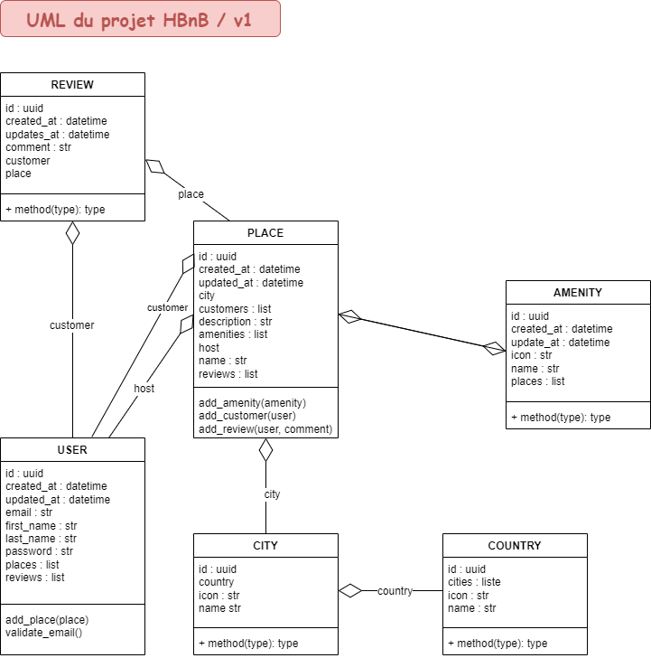

# holbertonschool-hbnb

## Description
Bienvenue dans la première étape de notre passionnant voyage - la création de notre propre application web, **HBnB Evolution**, modélisée d'après AirBnB en utilisant *Python* et *Flask*!

### Ce projet inclut :
- Une console pour gérer les objets de l'application
- Une API RESTful
- Une interface web pour interagir avec l'application

### Dans cette première partie, nous allons :
- Dessiner le squelette de notre application en utilisant UML (Unified Modeling Language).
- Créer des tests pour l'API et la logique métier.
- Implémenter l'API en utilisant Flask.
- Utiliser un système de stockage de données basé sur des fichiers.
- Emballer le tout dans une image Docker.

### Notre API est composée de trois couches :
- *Couche de services* : Elle gère toutes les requêtes et les réponses.
- *Couche de logique métier* : C'est là que se déroulent tous les traitements et les prises de décision.
- *Couche de persistance* : Pour l'instant, c'est notre humble système de fichiers, mais nous passerons à une base de données à l'avenir.
### UML



## Installation
### Prérequis
- Python 3.11
- pip

### Cloner le dépôt
Pour obtenir le code de ce projet sur votre machine locale pour le développement et les tests, utilisez les commandes suivantes :
```sh
git clone https://github.com/ChSPN/holbertonschool-hbnb.git
cd holbertonschool-hbnb
```


## Utilisation
### Installation des prérequis
```sh
pip install --no-cache-dir -r requirements.txt
```

### Lancer le serveur web
```sh
python3 -m api
```
Le serveur web démarre sur http://localhost:5000/. Ouvrez un navigateur et naviguez vers cette URL pour accéder à l'interface web.


## Fonctionnalités
- *Console* : Interface en ligne de commande pour gérer les objets.
- *API RESTful* : Points d'accès pour manipuler les données via des requêtes HTTP.
- *Interface web* : Frontend interactif pour l'application.


## Architecture du projet
- *datas/*: Contient les données persistantes en JSON.
- *entities/* : Contient les entités.
- *managers/* : Contient les classes managers.
- *repositories/* : Contient les repositories d'accès aux données.
- *resources/* : Contient les endpoints des APIs.
- *tests/* : Contient les mocks pour les tests.
- *api.py* : Contient les APIs.
- *test.py* : Contient les tests unitaires.


## Tests
Pour exécuter les tests, utilisez la commande suivante :
```sh
python3 -m test
```
Les tests sont organisés dans le dossier tests/ et couvrent différentes parties de l'application.
`

### Créer l'image docker
```sh
docker build -t hbnb:1.0.0 -f Dockerfile .
```


### Executer l'image docker
```sh
docker run -d -v $PATH:/app/datas -e "PORT=5000" -p 5000:5000 hbnb:1.0.0
```


## Contributeur
Charlène SCOMPARIN

